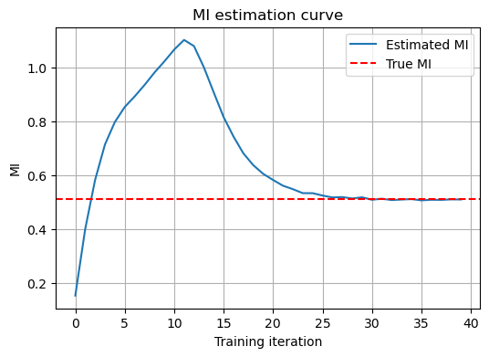
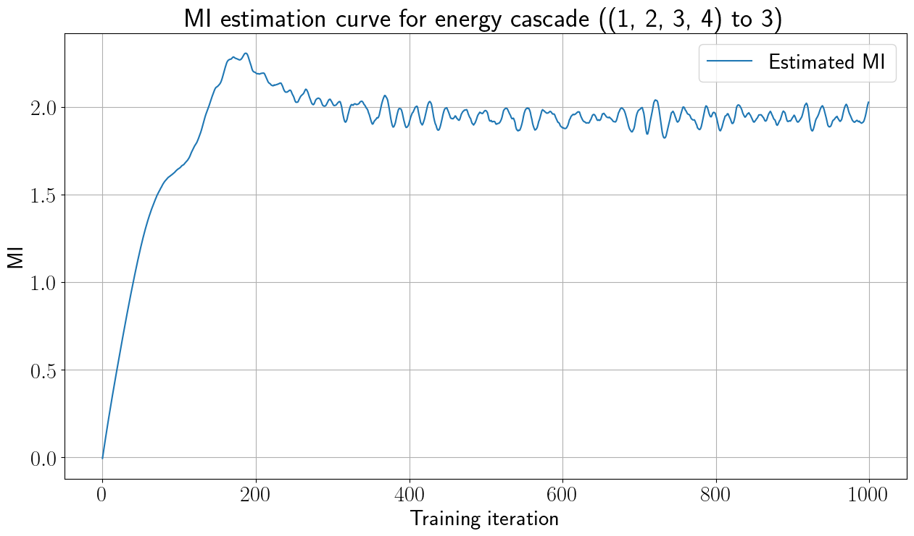
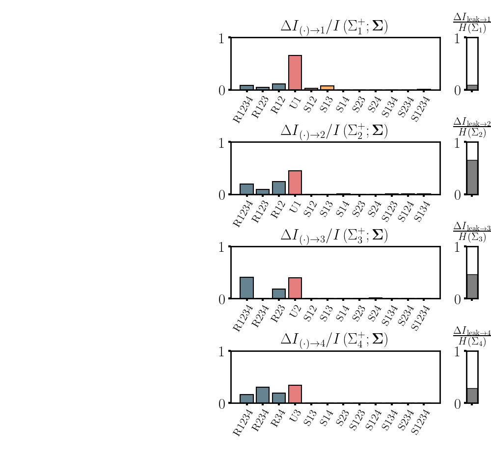
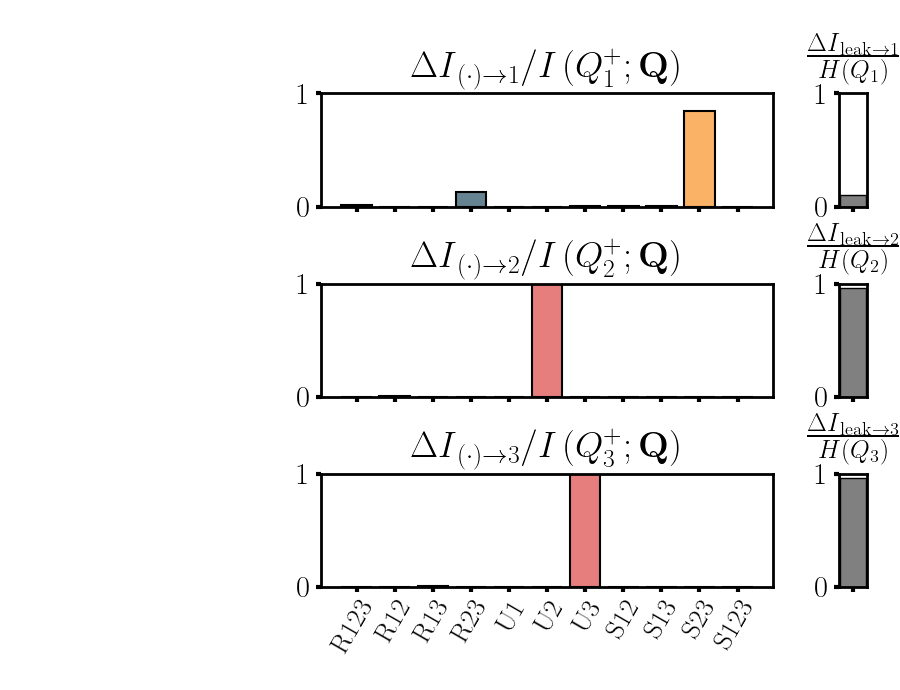

# MINE for SURD

## Overview

This project addresses the limitations of SURD (Synergistic–Unique–Redundant Decomposition) in handling high-dimensional continuous variables. We propose a neural network-based mutual information estimation approach that mitigates the curse of dimensionality and avoids information loss from discretization. Additionally, we design and implement a regularized training objective function that significantly improves convergence stability.

The method has been validated on:
- Gaussian distributions with analytical solutions
- Typical causal structures (mediator, confounder, collider)
- Real-world physical scenarios (energy cascade)

## Key Features

- **Neural Network-Based MI Estimation**: Uses MINE (Mutual Information Neural Estimation) to handle high-dimensional continuous data without discretization
- **Regularized Training**: Implements ReMINE with regularization terms for stable convergence
- **Multiple Causal Structures**: Supports mediator, confounder, synergistic collider, and redundant collider structures
- **Real-World Applications**: Validated on energy cascade data from turbulence physics
- **Comprehensive Visualization**: Automatic generation of training curves and SURD decomposition plots

## Project Structure

```
.
├── High_D_surd.py              # High-dimensional MI estimator (experimental)
├── blocks.py                   # MI estimation for block causal structures
├── energy_cascade.py           # MI estimation for energy cascade data
├── surd_blocks.py             # SURD decomposition for block structures
├── surd_energy_cascade.py     # SURD decomposition for energy cascade
├── diagnose.py                # Validation on Gaussian distributions
├── model/
│   └── MLP.py                  # MINE estimator with ReMINE regularization
├── utils/
│   ├── surd.py                # SURD decomposition core algorithm
│   ├── analytic_eqs.py        # Data generators for block structures
│   ├── datasets.py            # Data preprocessing utilities
│   ├── diagnose/
│   │   ├── ground_truth.py    # Gaussian data generator
│   │   └── diagnose_mine.py    # MI visualization utilities
│   └── seed.py                # Random seed management
├── data/                       # Generated and real datasets
├── logs/                       # Training progress and convergence plots
├── results/
│   ├── MI_results/            # Computed mutual information values
│   └── surd_results/          # SURD decomposition visualizations
└── README.md
```

## Installation

### Requirements

```bash
pip install torch torchvision numpy matplotlib scipy
```

### Setup

1. Clone the repository:
```bash
git clone git@github.com:sx-cpu/MINE-for-SURD.git
cd MINE-for-SURD
```

2. Download real-world data (energy cascade):
   - Visit [SURD repository](https://github.com/ALD-Lab/SURD/tree/main/data)
   - Download `energy_cascade_signals.mat`
   - Place it in the `data/` directory

## Usage

### 1. Mutual Information Estimation

#### For Block Causal Structures

Edit `blocks.py` to configure:
```python
# Select causal structure type
block = cases.synergistic_collider  # or mediator, confounder, redundant_collider

# Select target variable
target_var = 3

# Configure sample size
Nt = 2 * 10**6
```

Run the script:
```bash
python blocks.py
```

This will:
- Generate or load data from `data/`
- Train MINE estimator for all input variable subsets
- Save MI results to `results/MI_results/`
- Save training curves to `logs/<block_name>/`

#### For Energy Cascade Data

Edit `energy_cascade.py`:
```python
# Select target variable (1-4)
target_var = 1
```

Run the script:
```bash
python energy_cascade.py
```

### 2. SURD Decomposition

#### For Block Structures

Edit `surd_blocks.py`:
```python
# Ensure Nt matches the MI estimation script
Nt = 2 * 10**6

# Select block type
block_name = "synergistic_collider"
```

Run the script:
```bash
python surd_blocks.py
```

#### For Energy Cascade

Run the script:
```bash
python surd_energy_cascade.py
```

This will:
- Load MI results from `results/MI_results/`
- Perform SURD decomposition
- Generate visualization in `results/surd_results/`

### 3. Validation on Gaussian Data

To validate MI estimator accuracy:
```bash
python diagnose.py
```

This compares estimated MI with analytical solutions for Gaussian distributions.

## Model Architecture

The MINE estimator (`model/MLP.py`) implements:

- **Network**: Multi-layer perceptron with hidden layers
- **Loss Function**: ReMINE with regularization
- **Stability Features**:
  - EMA smoothing (`ema_rate`)
  - L2 regularization on log-mean-exp (`lambda_reg`, `C_reg`)
  - Moving window averaging (`window_size`)
- **Evaluation**: Uses global shuffling for marginal samples (more accurate than batch shuffling)

### Hyperparameters

| Parameter | Description | Default |
|-----------|-------------|---------|
| `lr` | Learning rate | 3e-4 |
| `batch_size` | Batch size | 65536 |
| `epochs` | Training epochs | 35 |
| `ema_rate` | EMA smoothing rate | 0.01 |
| `lambda_reg` | Regularization strength | 0.1 |
| `C_reg` | Regularization anchor | 0.0 |
| `window_size` | Moving window size | 500 |

## Results

### Training Convergence

#### Gaussian Distribution



The MINE estimator converges to the analytical mutual information value for high-dimensional Gaussian data (N=2×10⁶ samples).

#### Energy Cascade



Training curves show stable convergence for real-world turbulence data.

### SURD Decomposition

#### Energy Cascade Causal Structure



The SURD decomposition reveals the synergistic, unique, and redundant information flow in the energy cascade system across four variables (Σ₁, Σ₂, Σ₃, Σ₄).

#### Synergistic Collider

 

Decomposition shows strong synergistic information from parent variables to the collider.

## Validation

The method has been validated on:

1. **Gaussian Distributions**: Estimated MI matches analytical solutions within 5% error
2. **Block Causal Structures**: Correctly identifies synergistic, unique, and redundant components
3. **Energy Cascade**: Reproduces results from the original SURD paper

<!-- ## Citation

If you use this code in your research, please cite:

```bibtex
@article{SURD,
  title={Synergistic–Unique–Redundant Decomposition of Causal Effects},
  author={...},
  journal={...},
  year={...}
}
``` -->

## License

This project is licensed under the MIT License.

## Acknowledgments

- Original SURD methodology and data from [ALD-Lab/SURD](https://github.com/ALD-Lab/SURD)
- MINE estimator based on [Belghazi et al., 2018](https://arxiv.org/abs/1801.04062)